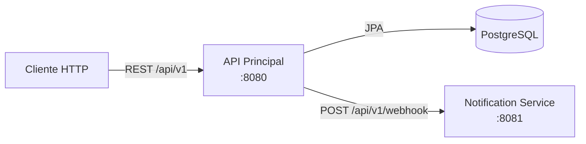
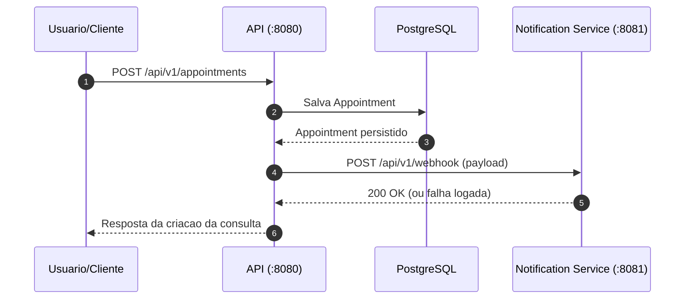

# Hospital Management System (HMS)

<div align="center">


</div>

Sistema backend para gerenciamento hospitalar composto por dois servicos Spring Boot:

- `api`: servico principal com CRUD de pacientes, medicos, consultas e cobrancas.
- `hospital_notification_service`: servico auxiliar que recebe notificacoes via webhook quando uma consulta e criada.

## 🧭 Guia de Navegação (Índice)

- **[🏥 Visão Geral](#visao-geral)**
- **[🧱 Arquitetura do Repositório](#arquitetura-do-repositorio)**
- **[🛠️ Tecnologias e Dependências](#tecnologias-e-dependencias)**
- **[📁 Estrutura de Pastas](#estrutura-de-pastas)**
- **[⚙️ Pré-requisitos](#pre-requisitos)**
- **[🔐 Variáveis de Ambiente](#variaveis-de-ambiente)**
- **[▶️ Como Executar](#como-executar)**
- **[🔗 Endpoints da API Principal](#endpoints-da-api-principal)**
- **[🔔 Endpoint do Serviço de Notificações](#endpoint-do-servico-de-notificacoes)**
- **[🔄 Fluxo de Webhook Entre Serviços](#fluxo-de-webhook-entre-servicos)**
- **[🗺️ Diagramas](#diagramas)**
- **[📈 Observabilidade e Logs](#observabilidade-e-logs)**
- **[👤 Sobre o Desenvolvedor](#sobre-o-desenvolvedor)**
- **[📜 Licença](#licenca)**

## 🏥 Visão Geral <a name="visao-geral"></a>

Este repositório implementa uma arquitetura de microsservicos simples para um contexto hospitalar:

- Cadastro e gerenciamento de pacientes, medicos, consultas e cobrancas.
- Persistencia em PostgreSQL no servico principal.
- Notificacao assincrona simples (via HTTP) ao criar consultas.
- Exposicao de endpoints de observabilidade com Spring Actuator.

## 🧱 Arquitetura do Repositório <a name="arquitetura-do-repositorio"></a>

- `api` (porta padrao `8080`, contexto `/api/v1`):
  - CRUD completo para `patients`, `doctors`, `appointments` e `bills`.
  - Integracao com banco de dados via Spring Data JPA.
  - Envio de webhook ao criar uma consulta.
- `hospital_notification_service` (porta `8081`, contexto `/api/v1`):
  - Endpoint `POST /webhook` para receber notificacoes.
  - Registro de payload recebido em log.

Fluxo resumido:

1. Cliente cria uma consulta em `api`.
2. `api` persiste a consulta.
3. `api` envia `POST` para `http://localhost:8081/api/v1/webhook`.
4. `hospital_notification_service` registra a notificacao.

## 🛠️ Tecnologias e Dependências <a name="tecnologias-e-dependencias"></a>

- Java `25` (toolchain nos dois modulos).
- Gradle Wrapper `9.3.1`.
- Spring Boot `4.0.3`.
- Spring Web MVC / Web.
- Spring Data JPA (`api`).
- PostgreSQL JDBC (`api`).
- Lombok.
- Spring Actuator (`api`).
- Log4j2 (`api`, substituindo starter de logging padrao).
- Dotenv (`api`) via `springboot4-dotenv`.

## 📁 Estrutura de Pastas <a name="estrutura-de-pastas"></a>

```text
.
├── api/
│   ├── src/main/java/dev/alanryan/hospitalmanagementsystem/api/
│   │   ├── controllers/
│   │   ├── models/
│   │   ├── repository/
│   │   └── service/
│   └── src/main/resources/
│       ├── application.properties
│       └── application-prod.properties
├── hospital_notification_service/
│   └── src/main/java/dev/alanryan/hospitalnotificationservice/
│       └── controllers/
└── README.md
```

## ⚙️ Pré-requisitos <a name="pre-requisitos"></a>

- JDK `25` instalado e configurado no `PATH`.
- PostgreSQL em execucao.
- Permissao de execucao para os wrappers Gradle (`chmod +x gradlew`).

## 🔐 Variáveis de Ambiente <a name="variaveis-de-ambiente"></a>

No modulo `api`, copie `api/.env.example` para `api/.env` e preencha:

```env
DB_URL=jdbc:postgresql://localhost:5432/seu_banco
DB_USERNAME=seu_usuario
DB_PASSWORD=sua_senha
```

Observacoes:

- `spring.datasource.*` em `api/src/main/resources/application.properties` usa essas variaveis.
- Em perfil padrao, `spring.jpa.hibernate.ddl-auto=update`.
- Em perfil `prod` (`application-prod.properties`), logs SQL e stacktrace sao reduzidos.

## ▶️ Como Executar <a name="como-executar"></a>

Suba primeiro o servico de notificacoes e depois a API principal.

1. Iniciar o servico de notificacoes

```bash
cd hospital_notification_service
chmod +x gradlew
./gradlew bootRun
```

2. Iniciar a API principal

```bash
cd api
cp .env.example .env
chmod +x gradlew
./gradlew bootRun
```

3. Executar API com perfil de producao (opcional)

```bash
cd api
SPRING_PROFILES_ACTIVE=prod ./gradlew bootRun
```

URLs base:

- API principal: `http://localhost:8080/api/v1`
- Servico de notificacoes: `http://localhost:8081/api/v1`

## 🔗 Endpoints da API Principal <a name="endpoints-da-api-principal"></a>

Base URL: `http://localhost:8080/api/v1`

Paginacao:

- Endpoints `GET` de listagem aceitam `page` e `size`.
- Padrao atual no codigo: `page=0`, `size=2`.

### Pacientes (`/patients`)

- `GET /patients?page=0&size=2`
- `GET /patients/{id}`
- `POST /patients`
- `PUT /patients/{id}`
- `DELETE /patients/{id}`

Exemplo de payload:

```json
{
  "name": "Maria Silva",
  "gender": "F",
  "age": 37
}
```

### Medicos (`/doctors`)

- `GET /doctors?page=0&size=2`
- `GET /doctors/{id}`
- `POST /doctors`
- `PUT /doctors/{id}`
- `DELETE /doctors/{id}`

Exemplo de payload:

```json
{
  "name": "Dr. Joao Pereira",
  "speciality": "Cardiologia"
}
```

### Consultas (`/appointments`)

- `GET /appointments?page=0&size=2`
- `GET /appointments/{id}`
- `POST /appointments` (dispara webhook)
- `PUT /appointments/{id}`
- `DELETE /appointments/{id}`

Exemplo de payload:

```json
{
  "patientId": 1,
  "doctorId": 2,
  "date": "2026-03-07T14:30:00"
}
```

### Cobrancas (`/bills`)

- `GET /bills?page=0&size=2`
- `GET /bills/{id}`
- `POST /bills`
- `PUT /bills/{id}`
- `DELETE /bills/{id}`

Exemplo de payload:

```json
{
  "patientId": 1,
  "amount": 249.9,
  "status": "PENDING"
}
```

Exemplo rapido com `curl`:

```bash
curl -X POST http://localhost:8080/api/v1/appointments \
  -H "Content-Type: application/json" \
  -d '{"patientId":1,"doctorId":2,"date":"2026-03-07T14:30:00"}'
```

## 🔔 Endpoint do Serviço de Notificações <a name="endpoint-do-servico-de-notificacoes"></a>

Base URL: `http://localhost:8081/api/v1`

- `POST /webhook`

Comportamento atual:

- Recebe qualquer payload JSON (`Object payload`).
- Registra no log:
  - `NOVA NOTIFICAÇÃO RECEBIDA!`
  - `Payload recebido: ...`

## 🔄 Fluxo de Webhook Entre Serviços <a name="fluxo-de-webhook-entre-servicos"></a>

Implementacao atual no `AppointmentService`:

- URL de destino fixa: `http://localhost:8081/api/v1/webhook`.
- O envio ocorre apos salvar a consulta no banco.
- Falhas no envio sao logadas, mas nao desfazem a criacao da consulta.

Implicacao pratica:

- A persistencia da consulta e desacoplada da confirmacao de recebimento do webhook.

## 🗺️ Diagramas <a name="diagramas"></a>

### Arquitetura Geral



### Sequencia: Criacao de Consulta + Webhook



## 📈 Observabilidade e Logs <a name="observabilidade-e-logs"></a>

No modulo `api`:

- Actuator habilitado com exposicao de todos os endpoints:
  - `management.endpoints.web.exposure.include=*`
- Health com detalhes habilitados:
  - `management.endpoint.health.show-details=always`
- Contexto da aplicacao:
  - `server.servlet.context-path=/api/v1`

Exemplos uteis:

- `GET http://localhost:8080/api/v1/actuator/health`
- `GET http://localhost:8080/api/v1/actuator`

## 👤 Sobre o Desenvolvedor <a name="sobre-o-desenvolvedor"></a>

<table align="center">
  <tr>
    <td align="center">
        <br>
        <a href="https://github.com/0nF1REy" target="_blank">
          
        </a>
        </p>
        <a href="https://github.com/0nF1REy" target="_blank">
          <strong>Alan Ryan</strong>
        </a>
        </p>
        Peopleware | Tech Enthusiast | Code Slinger
        <br>
        Apaixonado por codigo limpo, arquitetura escalavel e experiencias digitais envolventes
        </p>
          Conecte-se comigo:
        </p>
        <a href="https://www.linkedin.com/in/alan-ryan-b115ba228" target="_blank">
          
        </a>
        <a href="https://gitlab.com/alanryan619" target="_blank">
          
        </a>
        <a href="mailto:alanryan619@gmail.com" target="_blank">
          
        </a>
        </p>
    </td>
  </tr>
</table>

## 📜 Licença <a name="licenca"></a>

Este projeto esta sob a **licenca MIT**. Consulte o arquivo **[LICENSE](LICENSE)** para obter mais detalhes.

> ℹ️ **Aviso de Licenca:** &copy; 2026 Alan Ryan da Silva Domingues. Este projeto esta licenciado sob os termos da licenca MIT. Isso significa que voce pode usa-lo, copia-lo, modifica-lo e distribui-lo com liberdade, desde que mantenha os avisos de copyright.

Se este repositorio foi util para voce, considere dar uma estrela.
